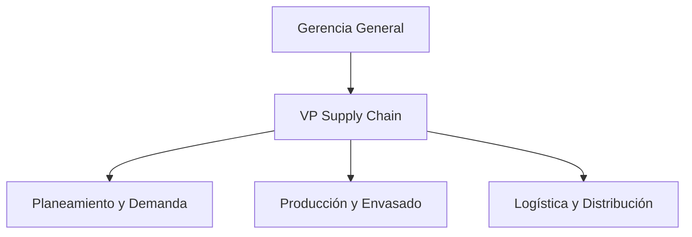

----------------------
# 1. RESUMEN DEL PROYECTO 

El presente proyecto de investigación aborda la optimización en el planeamiento de operaciones de Alicorp S.A.A., enfocándose en la variabilidad de la demanda de su producto líder de consumo masivo: Aceite Primor (Presentación 1 Litro). Mediante la aplicación sistemática del ciclo de mejora continua PHVA, se diagnosticó un desfase crítico en la programación de la producción y el control de inventarios de productos terminados, ocasionado por la ausencia de un modelo predictivo estandarizado.

A través del desarrollo de un plan de acción basado en la metodología 5W-2H y la formulación técnica de modelos estadísticos (Promedio Móvil y Regresión Lineal), se evalúan cuantitativamente las proyecciones del mercado frente a restricciones operativas reales. El proyecto integra el análisis de precisión del pronóstico (indicadores MAD y MSE), la viabilidad técnico-económica y la identificación de riesgos logísticos. El objetivo central es establecer una base matemática sólida que mitigue los sobrecostos por almacenamiento y los quiebres de stock en el canal de distribución exclusivo, asegurando la eficiencia operativa y la rentabilidad de la cadena de suministro.

-------------

# 2. ASPECTOS GENERALES DE LA EMPRESA 

## 2.1. Razón Social y Rubro 

- Razón Social: Alicorp S.A.A.

- Rubro: Producción y distribución de productos de consumo masivo (alimentos, cuidado del hogar y cuidado personal), productos industriales (B2B) y nutrición animal.

##  2.2. Misión, Visión y Valores 

- Misión: Transformamos mercados a través de nuestras marcas líderes, generando experiencias extraordinarias en nuestros consumidores. Buscamos innovar constantemente para generar valor y bienestar en la sociedad.
- Visión: Ser líderes en los mercados en los que competimos. 
- Valores: Lideramos con pasión, actuamos con agilidad, cumplimos con estándares muy altos, respetamos y trabajamos con confianza.

## 2.3. Descripción de la Actividad Comercial y Enfoque Operativo 

Alicorp S.A.A. es la empresa de consumo masivo más grande del Perú, con una presencia regional que se extiende a más de 14 países. La complejidad de su negocio radica en la gestión de una cadena de suministro de alta escala (Supply Chain) orientada a abastecer tanto al canal moderno (supermercados y grandes almacenes) como al canal tradicional (distribuidores exclusivos, mayoristas y bodegas).

Para efectos de rigurosidad en este proyecto de Gestión de Operaciones, el estudio se delimita específicamente en la Planta de Consumo Masivo del Callao, analizando la línea automatizada de envasado de Aceite Primor de 1L. Este producto se caracteriza por presentar un comportamiento dinámico, sensible a factores.

## 2.3. Organigrama Funcional de Operaciones 

El análisis se concentra bajo el liderazgo de la Vicepresidencia de Supply Chain, estructurada internamente de la siguiente manera para el soporte del flujo de valor:

-------