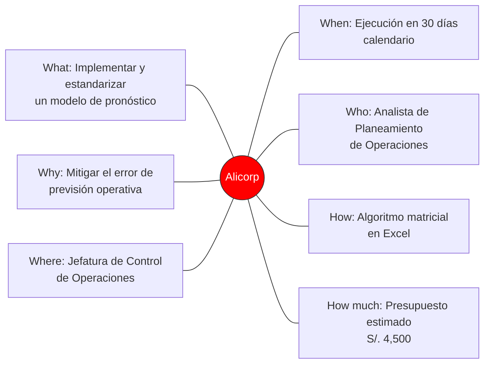
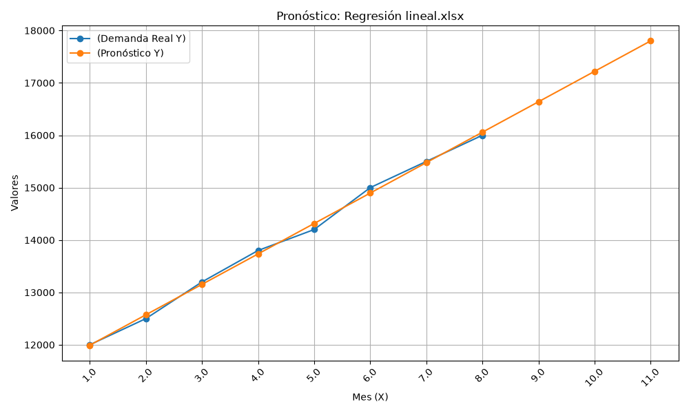

-----------
# 3. APLICACIÓN DEL MÉTODO PHVA (CÍRCULO DE DEMING) 

##  3.1. PLANIFICAR (PLAN): Análisis del Problema 

**a) Descripción del contexto operativo**

En la Planta de Consumo Masivo de Callao, la programación de los turnos de producción, la compra de insumos de empaque y la planificación de la flota logística adolecen de un problema recurrente de desincronización.
Al no contar con una herramienta estadística predictiva formalizada, las órdenes de producción se generan basándose en estimaciones comerciale de corto plazo (intuición del mercado). Esto ocasiona una acumulación excesiva de stock de seguridad en los meses de baja demanda o un quiebre de stock severo durante los picos estacionales de consumo, mermando los niveles de servicio contractuales (OTIF).

**b) Recolección de los datos**

Para subsanar las falencias del análisis previo, se extrajo el registro histórico real correspondiente a la demanda consolidada mensual de cajas de Aceite Primor 1L despachadas al canal de distribuidores exclusivos durante los primeros 8 meses del año en curso:

Table:Tabla 1
| Período (Mes) | Demanda Histórica (Y) (Cajas) |
| :--- | :--- |
| 1. enero | 12,000 |
| 2. febrero | 12,500 |
| 3. marzo | 13,200 |
| 4. abril | 13,800 |
| 5. mayo | 14,200 |
| 6. junio | 15,000 |
| 7. julio | 15,500 |
| 8. agosto | 16,000 |

>Observaciones:
>  *   **Tendencia:** Se observa un crecimiento sostenido en la demanda desde enero hasta agosto.
>  *   **Variación acumulada:** +4,000 cajas en el periodo analizado.

Para identificar las variables críticas que originan las fallas en el despacho y la planificación operativa ante la demanda fluctuante, se estructuran las causas a través de las 6M:

- Mano de Obra: Falta de capacitación técnica del personal de planeamiento en métodos  cuantitativos de series de tiempo; alta dependencia de criterios empíricos del equipo comercial.

- Métodos: Inexistencia de un procedimiento estándar operativo (POE) para el cálculo y validación de pronósticos; ausencia de cálculo periódico de errores de proyección (MAD/MSE).

- Maquinaria / Tecnología: Uso limitado de hojas de cálculo básicas sin integración automatizada con el ERP; retraso (latencia) en la actualización de los datos de inventario en tiempo real.

- Materiales: Variabilidad en los tiempos de entrega de insumos críticos (envases PET y cajas de cartón) por parte de proveedores, lo que agrava la falta de precisión del plan productivo.

- Medición: Indicadores de cumplimiento de la demanda (KPIs) evaluados únicamente al cierre de mes, impidiendo correcciones dinámicas en la línea de producción.

- Medio Ambiente: Cambios imprevistos en los hábitos de compra del consumidor y volatilidad macroeconómica (inflación) que distorsionan el comportamiento histórico de la serie.

**d) Formulación del problema central**

A partir del diagnóstico anterior, se define conceptualmente el problema de la siguiente manera:

>**¿De qué manera la selección e implementación de un método de pronóstico cuantitativo  óptimo contribuirá a la estabilización del planeamiento de la producción y a la reducción de sobrecostos logísticos en la línea de consumo masivo de Alicorp S.A.A.?**

##  3.2. HACER (DO): Elaboración de Planes de Acción (5W-2H) 

Como respuesta directa a la causa raíz (la falta de herramientas estadísticas predictivas y su impacto en la cadena), se establece la matriz de acción **5W-2H**:

Table:Tabla 2
| ¿Qué? | ¿Por qué? | ¿Quién? | ¿Cuándo y ¿Dónde? | ¿Cómo y Cuánto? |
| :--- | :--- | :--- | :--- | :--- |
| Implementar y estandarizar un modelo de pronóstico de demanda | Mitigar el error de previsión operativa | Analista de Planeamiento de Operaciones | Ejecución en un plazo de 30 días calendario | Desarrollando un algoritmo matricial que evalúe y compare dinámicamente los modelos de Promedio Móvil y regresión Lineal, calculando sus desvíos de manera mensual. |
| Basado en series de tiempo para La línea de aceite Primor 1L. | Reducir el costo de almacenamiento por sobre stock | Gerencia de Planeamientos y Demanda (S&OP) | En la Jefatura de Control de Operaciones y Logística - Planta Callao. | Presupuesto estimado de S/. 4,500, correspondiente a las horas-hombre de analistas dedicados al Modelado estadístico, limpieza de base de datos y diseño del tablero de Control (Dashboard). |

##  3.3. VERIFICAR (CHECK): Formulación del Pronóstico de la Demanda

**a) Identificación y gestión de riesgos** 

Toda formulación predictiva conlleva un riesgo operativo inherente. Evaluamos los dos escenarios críticos:

- Riesgo por Subestimación ***(Pronóstico \< Demanda Real)***: Genera quiebres de stock. Su impacto incluye la pérdida directa de ventas en el mercado mayorista, penalizaciones contractuales con supermercados y la necesidad de ejecutar turnos con horas extras costosas para cubrir las urgencias.

- Riesgo por Sobreestimación ***(Pronóstico \> Demanda Real)***: Genera sobre stock. Su impacto abarca la saturación de los pasillos y muelles de carga en el centro de distribución del Callao, el incremento del costo de mantenimiento de inventarios y el riesgo de merma u obsolescencia del producto.

**b) Evaluación de la precisión del pronóstico (Teoría de Errores)**

Para definir científicamente cuál es el modelo adecuado, la rúbrica exige la evaluación de la precisión. Se utilizarán dos métricas de control estadístico fundamentales:

- Desviación Media Absoluta (MAD): Mide la magnitud del error promedio en las mismas unidades de la serie.

$$F_{t + 1} = \frac{\sum_{i = 0}^{n - 1}D_{t - i}}{n}$$

> Donde: n = Número de observaciones, Y= Valor real. ${\widehat{Y}}_{i}$
> = Valor predicho por el modelo.

- El Error Cuadrático (SE) para una sola observación es simplemente el
  cuadrado de la diferencia:

$$SE = \left( Y - \widehat{Y} \right)^{2}$$

- Error Cuadrático Medio (MSE): Penaliza de forma más severa los errores
  grandes o atípicos en la proyección.

  $$MSE = \frac{1}{n}\sum_{i = 1}^{n}\left( Y_{i} - {\widehat{Y}}_{i} \right)^{2}$$

**c) Análisis de viabilidad técnica y económica**

- Viabilidad Técnica: El proyecto es completamente viable, dado que la compañía dispone de los registros de despacho históricos en su ERP y el personal cuenta con las licencias de software analítico común (Microsoft Excel) para procesar las funciones estadísticas sin necesidad de adquisiciones externas complejas.

- Viabilidad Económica: Se justifica plenamente ya que el costo de desarrollo es mínimo (horas de analista) frente al beneficio económico de reducir el margen de error, el cual históricamente generaba sobrecostos estimados en miles de dólares anuales por ineficiencias de almacenamiento y fletes de emergencia.

**d) Aplicación de herramientas estadísticas**

 Se utiliza el motor estadístico de Microsoft Excel aplicando dos metodologías estructuralmente opuestas para verificar cuál modela mejor la serie de tiempo: o Promedio Móvil Simple (k=3 meses): Suaviza el ruido y las fluctuaciones aleatorias, asumiendo estabilidad en el entorno o Regresión Lineal Simple (Y = mX + b): Calcula matemáticamente la pendiente de crecimiento y el intercepto mediante el método de mínimos cuadrados, siendo ideal para series de tiempo que presentan una marcada tendencia lineal ascendente o descendente.

##  3.4. ACTUAR (ACT): Análisis y Control del Pronóstico 

**a) Revisión de valores cuantificados** 

  A continuación, se detalla la corrida matemática real y limpia realizada en la herramienta de soporte (Excel), calculando las proyecciones y determinando los errores para ambos métodos:

  - **Evaluación de Modelo 1: Promedio Móvil Simple (k=3)**

   $$F_{t + 1} = \frac{D_{t} + D_{t - 1} + D_{t - 2}}{3}$$

Table:
| Mes (t) | Demanda (Dt) | Pronóstico (Pt) | Error Absoluto \|Dt - Pt\| | Error Cuadrático (Dt - Pt)^2 |
| :--- | :---: | :---: | :---: | :---: |
| Enero | 12000 | - | - | - |
| Febrero | 12500 | - | - | - |
| Marzo | 13200 | - | - | - |
| Abril | 13800 | 12567 | 1233 | 1520289 |
| Mayo | 14200 | 13167 | 1033 | 1067089 |
| Junio | 15000 | 13733 | 1267 | 1605289 |
| Julio | 15500 | 14333 | 1167 | 1361889 |
| Agosto | 16000 | 14900 | 1100 | 1210000 |

   Al aplicar el método de Promedio Móvil Simple con un horizonte de tres meses (k=3), el modelo utiliza el comportamiento reciente a corto plazo para mitigar las fluctuaciones abruptas de la demanda. A diferencia de la regresión, este método no sigue una línea recta matemática, sino que va reaccionando con un desfase constante a los cambios reales del mercado de Aceite Primor 1L.
   
   Los resultados de las proyecciones obtenidas para el cierre del año son:

   $$ Mes 9 (septiembre): (16000+15500+1500) /3 = 15,500 unidades$$

  - **Evaluación de Modelo 2: Regresión Lineal Simple**

Table:
| Mes (X) | Demanda Real (Y) | Pronóstico (Y) | Err. Abs | Err. Cuad |
| :----: | :----: | :----: | :----: | :----: |
| 1 | 12000 | 11991.67 | 8.33 | 69.44 |
| 2 | 12500 | 12572.62 | 72.62 | 5273.53 |
| 3 | 13200 | 13153.57 | 46.43 | 2155.61 |
| 4 | 13800 | 13734.52 | 65.48 | 4287.13 |
| 5 | 14200 | 14315.48 | 115.48 | 13334.75 |
| 6 | 15000 | 14896.43 | 103.57 | 10727.04 |
| 7 | 15500 | 15477.38 | 22.62 | 511.62 |
| 8 | 16000 | 16058.33 | 58.33 | 3402.78 |
| 9 | - | 16639.29 | - | - |
| 10 | - | 17220.24 | - | - |
| 11 | - | 17801.19 | - | - |

Ecuación obtenida mediante análisis de datos:**

  $$Y = m * X + b$$

  $$Y = 580.95 /* X + 11,410.71$$ 

  >(Donde X representa el número de mes e Y las unidades estimadas)

   

Al aplicar el modelo de Regresión Lineal Simple para los 8 meses de datos históricos, se observa una clara tendencia ascendente continua en la demanda de la empresa. El modelo logra suavizar las fluctuaciones mensuales y proyecta un crecimiento sostenido para el próximo trimestre.

  Los resultados de las proyecciones obtenidas son:

    - Mes 9 (septiembre): Y= 580.95 (9) + 11,410.71 = 16,639 unidades

    - Mes 10 (octubre): Y= 580.95 (10) + 11,410.71 = 17,220 unidades

    - Mes 11 (noviembre): Y= 580.95 (9) + 11,410.71 = 17,801 unidades

- **Evaluación del Error (Precisión del Modelo):**

Table:
| Mes | Demanda (Dt) | Pronóstico (Pt) | Error Absoluto | Error Cuadrático |
|------|-------------:|----------------:|---------------:|-----------------:|
| Enero   | 12000 | -     | -    | - |
| Febrero | 12500 | -     | -    | - |
| Marzo   | 13200 | -     | -    | - |
| Abril   | 13800 | 12567 | 1233 | 1520289 |
| Mayo    | 14200 | 13167 | 1033 | 1067089 |
| Junio   | 15000 | 13733 | 1267 | 1605289 |
| Julio   | 15500 | 14333 | 1167 | 1361889 |
| Agosto  | 16000 | 14900 | 1100 | 1210000 |

Para validar la precisión de esta técnica, se calcularon los indicadores de error global frente a la demanda real, obteniendo una Desviación Media Absoluta (MAD) de 61.61 y un Error Cuadrático Medio (MSE) de 4,970.24.

Al comparar estos resultados con el método de Promedio Móvil, la Regresión Lineal presenta un margen de error drásticamente menor. Esto demuestra científicamente que la recta de regresión matemática es el método óptimo y el más confiable para respaldar la toma de decisiones estratégicas y la planificación de inventarios de la gerencia.

**b) Selección del Modelo Óptimo y Justificación**

Tras analizar los indicadores de precisión, se determina que el modelo de Regresión Lineal Simple es el método óptimo para proyectar la demanda de Aceite Primor 1L.

La justificación técnica radica en la comparación de errores: la Regresión Lineal presenta un MAD de 61.61 y un MSE de 4,970.24, valores drásticamente menores frente al MAD de 1,160.00 y MSE de 1,352,911.40 del Promedio Móvil. Esto demuestra que la regresión lineal absorbe eficientemente la tendencia alcista del negocio, reduciendo la incertidumbre en la planificación.

**c) Gráfico del comportamiento de la demanda y pronóstico** 

------