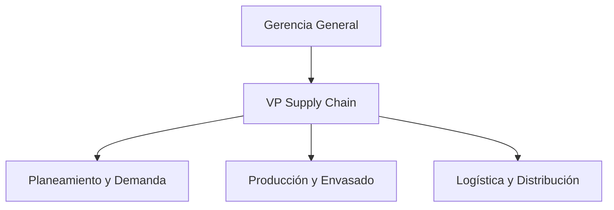
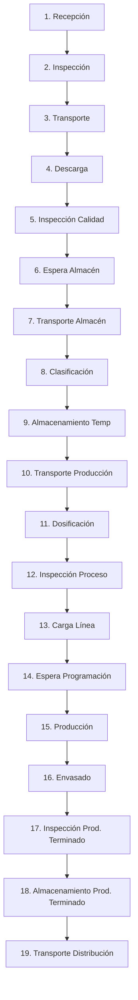

# RECURSOS GRAFICOS

## 1. Organigrama: Supply Chain

## 2. Promedio Móvil Simple (k=3)

| Mes | Demanda (Dt) | Pronóstico (Pt) | Error Absoluto | Error Cuadrático |
|------|-------------:|----------------:|---------------:|-----------------:|
| Enero   | 12000 | -     | -    | - |
| Febrero | 12500 | -     | -    | - |
| Marzo   | 13200 | -     | -    | - |
| Abril   | 13800 | 12567 | 1233 | 1520289 |
| Mayo    | 14200 | 13167 | 1033 | 1067089 |
| Junio   | 15000 | 13733 | 1267 | 1605289 |
| Julio   | 15500 | 14333 | 1167 | 1361889 |
| Agosto  | 16000 | 14900 | 1100 | 1210000 |

**Figura 3.1. Demanda vs Pronóstico**

[Demanda vs Pronóstico](imagenes/promedio_movil.png)

**Promedio demanda:** 14025

**MAD:** 1160

**MSE:** 1352911

# DAP - DIAGRAMA DE ANÁLISIS DEL PROCESO
## Recepción de Materia Prima en Alicorp S.A.A.

### Visualización del Flujo (Mermaid)

### Análisis de Densidad de Símbolos (DAP de Casilleros)

| Símbolo/Columna | Frecuencia | Densidad en el Flujo |
| :--- | :---: | :---: |
| Operación | 8 | 42.1% |
| Transporte | 4 | 21.1% |
| Inspección | 3 | 15.8% |
| Demora | 2 | 10.5% |
| Almacenamiento | 2 | 10.5% |